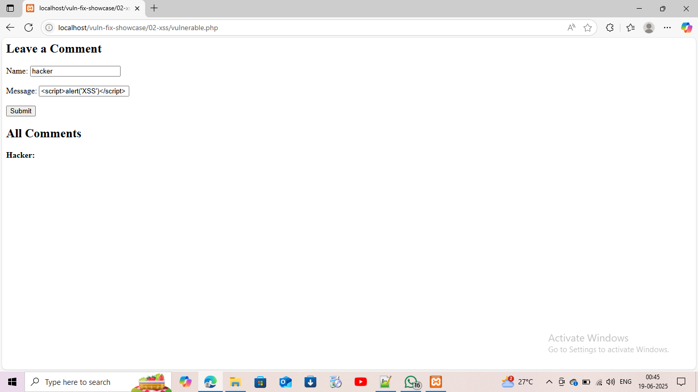
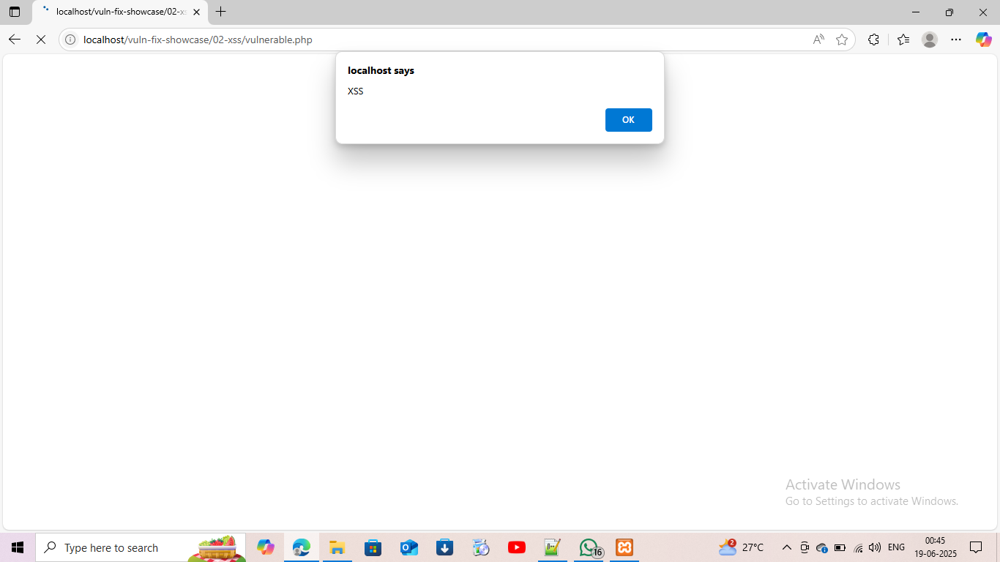
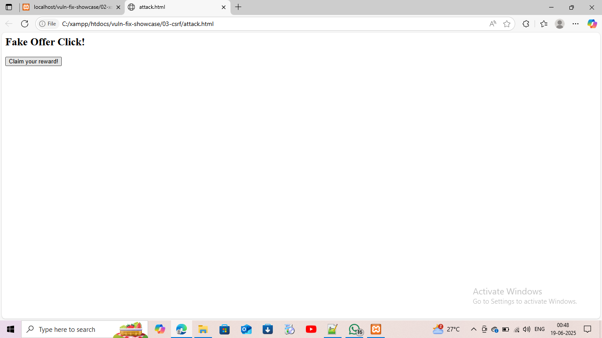
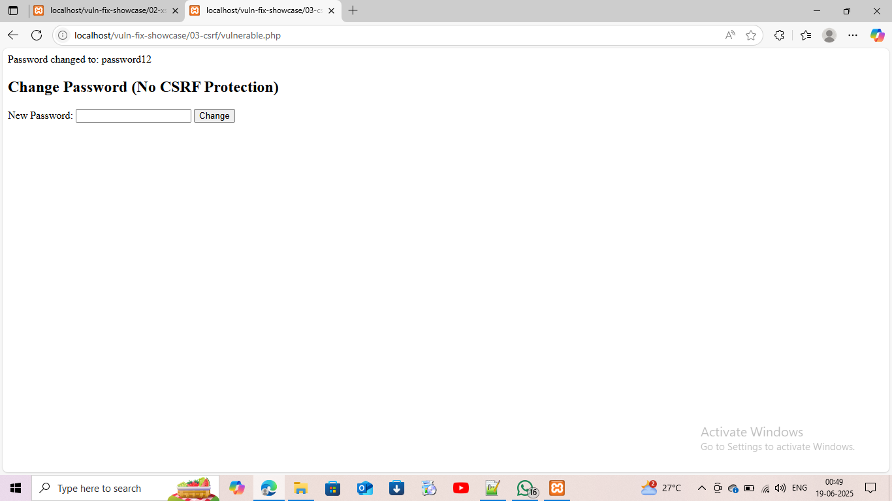
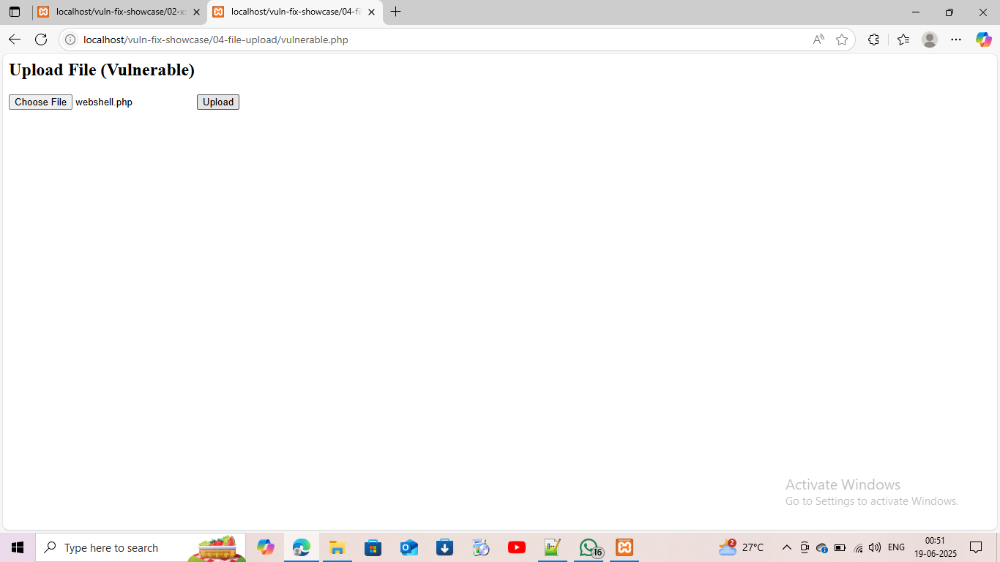
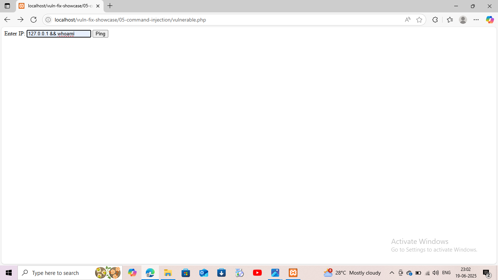
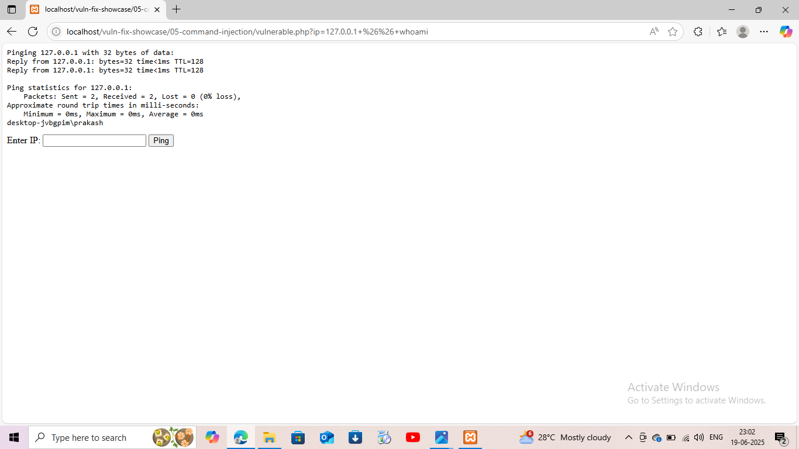

# 🔐 Cybersecurity Vulnerability Fixes – Client-Ready Showcase

This project demonstrates *five key web vulnerabilities* alongside their *secure PHP fixes*. It’s designed for use in:

- 🧪 Penetration testing practice  
- 💼 Client consulting deliverables  
- 📂 GitHub + freelance portfolio proof

---

## 📁 Folder Structure

| #  | Vulnerability       | Type                         |
|----|----------------------|------------------------------|
| 01 | SQL Injection        | Classic + Blind              |
| 02 | XSS                  | Stored + DOM                 |
| 03 | CSRF                 | Change Password Exploit      |
| 04 | File Upload          | Webshell Upload              |
| 05 | Command Injection    | OS Command Injection         |

Each folder contains:
- vulnerable.php – live exploit version  
- fixed.php – secure validation version  
- 🔍 Screenshots for clarity

---

## ⚙ Requirements

- 🖥 XAMPP (Apache + MySQL)
- 🧠 PHP 8.x
- 🌐 Browser (Chrome / Edge)
- 🛠 [Burp Suite](https://portswigger.net/burp) (optional)

---

## 🧪 Exploit Examples with Screenshots

### ✅ 01. SQL Injection

  
Injection entered into vulnerable field

  
Hashes + usernames revealed

---

### ✅ 02. Stored XSS

  
Stored XSS submitted

  
Payload triggers JavaScript execution

---

### ✅ 03. CSRF

  
Attacker submits auto-password-change

  
Password changed without user's knowledge

---

### ✅ 04. File Upload

  
webshell.php uploaded

  
Command injection via webshell

---

### ✅ 05. Command Injection

  
*Payload: 127.0.0.1 && whoami*

  
OS command executed via input

---

## 📦 Use This For

- ✅ GitHub Cybersecurity Portfolio
- ✅ Client-facing reports
- ✅ Freelance vulnerability auditing
- ✅ Explaining web app weaknesses visually

---

## 🧠 Author

*Ashish (Zerokeylabs)*  
Cryptography + Cybersecurity Developer  
🔗 GitHub: [github.com/Zerokeylabs](https://github.com/Zerokeylabs)

---

## 📂 More Screenshots

All screenshots available in the [/screenshots](screenshots/) folder.

---

## 📜 License

MIT – Use freely, with credit.